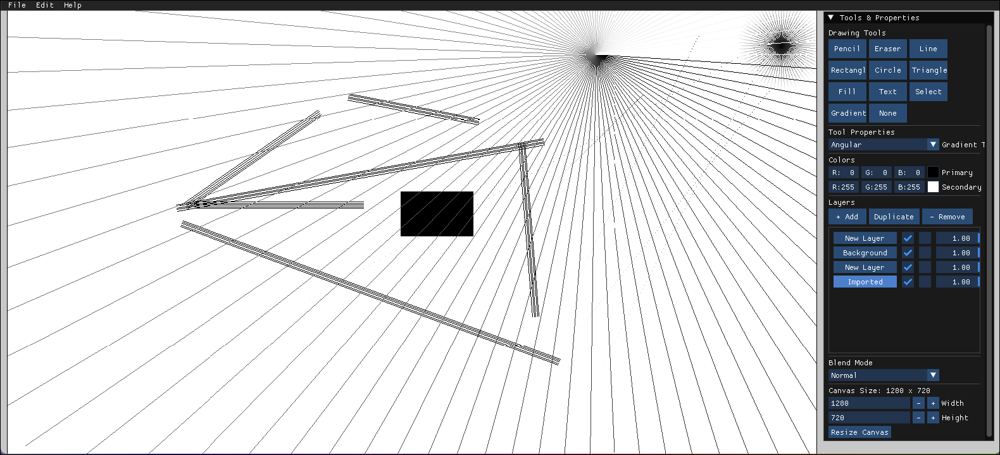

# Paint


This is a sophisticated paint application built with SDL2, featuring a comprehensive GUI, layer management, and professional-grade tools. The project evolved from Vikash Kumar's OpenGL tutorials on Udemy and has been significantly enhanced with modern features and bug fixes. The documentation was created with assistance from DeepSeek-R1 AI assistant.

## Key Improvements Over Previous Versions

- **Professional GUI**: Replaced basic TUI with Dear ImGui interface
- **Robust Layer System**: Added layer locking, duplication, and blending modes
- **Advanced Tools**: Implemented gradient tool, text tool with font options, and selection tools
- **Critical Bug Fixes**: Resolved memory leaks, coordinate system issues, and flood fill algorithm
- **Fedora Compatibility**: Tested and optimized for Fedora 38
- **Self-Contained Dependencies**: Option to build SDL2 locally

## Features

- **Professional GUI**: Modern interface with panels for tools, layers, and properties
- **Layer Management**: Create, duplicate, reorder, and blend layers with various modes
- **Drawing Tools**:
  - Pencil with adjustable size
  - Eraser with size control
  - Shapes: Line, Rectangle, Circle, Triangle
  - Gradient tool (linear, radial, angular)
  - Text tool with font customization
  - Selection tools with copy/paste
- **Color System**: Primary/secondary colors with swapping
- **Undo/Redo**: Comprehensive history system
- **File Operations**: Open/save images (PNG, JPG, BMP)
- **Canvas Control**: Dynamic resizing and panning

## Dependencies

- SDL2 (Simple DirectMedia Layer)
- SDL2_ttf (TrueType Font support)
- SDL2_image (Image loading support)
- Dear ImGui (Immediate mode GUI)
- TinyFileDialogs (Native file dialogs)

## Installation

### Fedora

```bash
sudo dnf install clang cmake gcc-c++ make libtool autoconf automake
git clone https://github.com/yourusername/sdl-paint-app.git
cd sdl-paint-app
python setup.py
```

### Other Linux Distributions

```bash
# Debian/Ubuntu
sudo apt install libsdl2-dev libsdl2-ttf-dev libsdl2-image-dev git python3

# Fedora
sudo dnf install SDL2-devel SDL2_ttf-devel SDL2_image-devel git python3

# Clone and setup
git clone https://github.com/Euclidae/Paint.git
cd Paint
python setup.py
python3 setup.py #for linux users
```
# Warning the python SDL2 bits of the script are not complete. You will have to install them yourself.
## Building

The Makefile supports both system and local SDL2 installations:

```bash
# Build with system SDL2 (default)
make

# Build with local SDL2
make USE_LOCAL_SDL=1

# Run the application
./bin/paint
```

## Usage

### Interface Overview
- **Left Area**: Drawing canvas (adjustable size)
- **Right Panel**: Tools and properties
- **Top Menu**: File operations and editing commands

### Tool Selection (Keyboard Shortcuts)
- `P`: Pencil Tool
- `E`: Eraser Tool
- `L`: Line Tool
- `R`: Rectangle Tool
- `C`: Circle Tool
- `T`: Triangle Tool
- `G`: Gradient Tool
- `S`: Selection Tool
- `F`: Paint Bucket (Flood Fill)
- `ESC`: Clear selection or reset tool

### Advanced Features
- **Layer Management**: Right panel for layer operations
- **Undo/Redo**: `Ctrl+Z` / `Ctrl+Y`
- **Color Swap**: `X` to swap primary/secondary colors
- **Brush Size**: Mouse wheel to adjust
- **Canvas Resizing**: Input fields in properties panel

## Technical Notes

### Key Fixes and Improvements
- **Memory Management**: Fixed texture leaks and improper cleanup
- **Flood Fill**: Replaced recursive algorithm with scanline method
- **Coordinate System**: Corrected canvas offset calculations
- **Font Handling**: Added caching for different font styles/sizes
- **Layer Rendering**: Fixed blend mode implementation
- **Selection Tools**: Added proper move/copy/paste functionality

### Fedora-Specific Considerations
- Added workarounds for Fedora's library paths
- Included Fedora-compatible build flags
- Resolved font loading issues on Fedora

### Performance Optimizations
- Texture-based undo/redo system
- Gradient tool optimized with fixed steps
- Font caching for text rendering
- Layer compositing improvements

## File Structure

```
sdl-paint-app/
├── bin/               # Compiled binary
├── imgui/             # Dear ImGui files
├── tinyfiledialogs/   # TinyFileDialogs files
├── sdl/               # Local SDL2 build (optional)
├── main.cpp           # Main application code
├── Makefile           # Build configuration
├── setup.py           # Dependency setup script
└── README.md          # This documentation
```

## Acknowledgments

- Inspired by Vikash Kumar's OpenGL tutorials on Udemy
- Initial version based on Dr. Mike Shah's C++ series
- Dear ImGui by Omar Cornut (special thanks to TheCherno for tutorials)
- SDL2 by Sam Lantinga and contributors
- TinyFileDialogs by Guillaume Vareille
- DeepSeek-R1 AI assistant for documentation support

## License

MIT License

Copyright (c) 2025 Euclidae

Permission is hereby granted, free of charge, to any person obtaining a copy
of this software and associated documentation files (the "Software"), to deal
in the Software without restriction, including without limitation the rights
to use, copy, modify, merge, publish, distribute, sublicense, and/or sell
copies of the Software, and to permit persons to whom the Software is
furnished to do so, subject to the following conditions:

The above copyright notice and this permission notice shall be included in all
copies or substantial portions of the Software.

THE SOFTWARE IS PROVIDED "AS IS", WITHOUT WARRANTY OF ANY KIND, EXPRESS OR
IMPLIED, INCLUDING BUT NOT LIMITED TO THE WARRANTIES OF MERCHANTABILITY,
FITNESS FOR A PARTICULAR PURPOSE AND NONINFRINGEMENT. IN NO EVENT SHALL THE
AUTHORS OR COPYRIGHT HOLDERS BE LIABLE FOR ANY CLAIM, DAMAGES OR OTHER
LIABILITY, WHETHER IN AN ACTION OF CONTRACT, TORT OR OTHERWISE, ARISING FROM,
OUT OF OR IN CONNECTION WITH THE SOFTWARE OR THE USE OR OTHER DEALINGS IN THE
SOFTWARE.