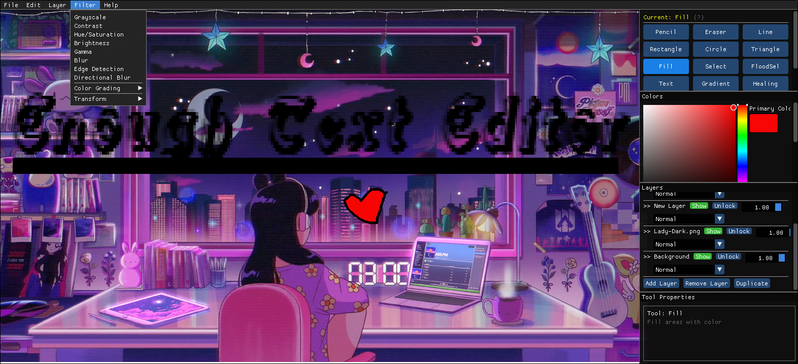

# Enough Image Editor



A graphics editor built with SDL2 and Dear ImGui, featuring layer management, drawing tools, and image filters. Originally procedural, later refactored to object-oriented architecture as a learning exercise.

**Project Name:** Enough Image Editor
**Executable:** EnoughImageEditor
**Repository:** Paint (folder name)

## Project Status

**This project is complete and no longer under active development.**

Started April 2025, ended July 11, 2025. I've had enough of working on this (pun intended). Feature complexity got out of hand, and my coding level makes proper maintenance impossible. DeepSeek, Claude, and Grok really helped me with documentation and setting up things I had trouble with. To be specific, the CMakeLists file and part of setup.py (I didn't know how to use zipfile and platform, and was unfamiliar with urllib—requests wasn't working). They also helped optimize the codebase when I got stuck, as some of the functions were from poorly written projects and could have been done better. I limited AI work on the code itself, relegating it to a glorified regex engine and occasional advisory role. Documentation was a struggle, but I managed to get it done with the help of the three models above. Documenting my code was so tedious I exhausted my Copilot tokens, so I had to paste back and forth.

**Known Issues:**
- Selection tool fundamentally broken
- Flood select changes colors when deleting
- Filter stacking causes segfaults
- Clone stamp tool doesn't actually work
- Recent files system fails silently
- Keyboard shortcuts unreliable
- Layer renaming appears to work but may have issues

**What's Next:** Moving to "Alcides" project - expect around September 2025.

## Dependencies

- **C++20** - Modern C++ standard with enhanced features and performance
- **SDL2** (Simple DirectMedia Layer) - Core graphics and input
- **SDL2_ttf** (TrueType Font support) - Font rendering
- **SDL2_image** (Image loading support) - Image format support
- **Dear ImGui** (Immediate mode GUI) - User interface (auto-downloaded)
- **TinyFileDialogs** (Native file dialogs) - Cross-platform file dialogs (auto-downloaded)

## Installation

### Quick Setup

**Requirements:**
- C++20 compatible compiler (GCC 10+, Clang 10+, or MSVC 2019+)
- CMake 3.12+ or Make
- Python 3 (for dependency setup)

```bash
# Clone the repository
git clone https://github.com/Euclidae/Paint.git
cd Paint

# Run setup script to download dependencies
python3 setup.py

# Build the application
make

# Run the application
./bin/EnoughImageEditor
```

### Platform-Specific Instructions

#### Linux (Ubuntu/Debian)
```bash
sudo apt update
# Install C++20 compiler and SDL2 dependencies
sudo apt install gcc-10 g++-10 libsdl2-dev libsdl2-ttf-dev libsdl2-image-dev build-essential python3
# Set GCC 10 as default for C++20 support
sudo update-alternatives --install /usr/bin/gcc gcc /usr/bin/gcc-10 10
sudo update-alternatives --install /usr/bin/g++ g++ /usr/bin/g++-10 10
python3 setup.py
make
./bin/EnoughImageEditor
#or just use cmake. Linux users should be technical enough to know how to do that on their own
```

#### Linux (Fedora/RHEL)
```bash
# Install C++20 compiler and SDL2 dependencies (GCC 10+ for C++20 support)
sudo dnf install SDL2-devel SDL2_ttf-devel SDL2_image-devel gcc-c++ make python3
python3 setup.py
make
./bin/EnoughImageEditor
#or just use cmake. Linux users should be technical enough to know how to do that on their own
```

#### Linux (Arch)
```bash
# Install C++20 compiler and SDL2 dependencies (GCC in base-devel supports C++20)
sudo pacman -S sdl2 sdl2_ttf sdl2_image base-devel python3
python3 setup.py
make
./bin/EnoughImageEditor
#or just use cmake. Linux users should be technical enough to know how to do that on their own
```

#### macOS
```bash
# Install Homebrew if not already installed
/bin/bash -c "$(curl -fsSL https://raw.githubusercontent.com/Homebrew/install/HEAD/install.sh)"

# Install Xcode Command Line Tools for C++20 support
xcode-select --install

# Install dependencies
brew install sdl2 sdl2_ttf sdl2_image python3
```

#### Windows

**Prerequisites:**
- Windows 10 or later
- MSYS2 (recommended) or MinGW-w64
- Python 3.x
- Git

**Step 1: Install MSYS2**
1. Download MSYS2 from [https://www.msys2.org/](https://www.msys2.org/)
2. Run the installer and follow the installation wizard
3. After installation, open MSYS2 terminal and update the package database:
   ```bash
   pacman -Syu
   ```
4. Close the terminal when prompted and reopen it, then run:
   ```bash
   pacman -Su
   ```

**Step 2: Install Development Tools and Dependencies**
In the MSYS2 terminal, install the required packages:
```bash
# Install base development tools
pacman -S mingw-w64-ucrt-x86_64-toolchain
pacman -S mingw-w64-ucrt-x86_64-cmake
pacman -S mingw-w64-ucrt-x86_64-make

# Install SDL2 and related libraries
pacman -S mingw-w64-ucrt-x86_64-SDL2
pacman -S mingw-w64-ucrt-x86_64-SDL2_ttf
pacman -S mingw-w64-ucrt-x86_64-SDL2_image

# Install WebP support (fixes WebP dependency issues)
pacman -S mingw-w64-ucrt-x86_64-libwebp

# Install Python
pacman -S mingw-w64-ucrt-x86_64-python
```

**Step 3: Add MSYS2 to Windows PATH**
1. Open Windows Settings → System → About → Advanced system settings
2. Click "Environment Variables"
3. In System Variables, find and select "Path", then click "Edit"
4. Add these paths (adjust if MSYS2 is installed elsewhere):
   - `C:\msys64\ucrt64\bin`
   - `C:\msys64\usr\bin`
5. Click OK to save changes
6. **Important**: Restart your terminal/IDE after modifying PATH

**Step 4: Clone and Build the Project**

**Option A: Using PowerShell/Command Prompt**
```powershell
# Clone the repository
git clone https://github.com/Euclidae/Paint.git
cd Paint

# Run setup script to download dependencies
python setup.py

# Create build directory
mkdir build
cd build

# Configure with CMake
cmake ..

# Build the application
cmake --build . --config Debug

# The executable will be in build/bin/EnoughImageEditor.exe
```

**Option B: Using MSYS2 Terminal**
```bash
# Clone the repository
git clone https://github.com/Euclidae/Paint.git
cd Paint

# Run setup script
python3 setup.py

# Create build directory
mkdir build && cd build

# Configure with CMake
cmake ..

# Build with make
make

# Run the application
./bin/EnoughImageEditor.exe
```

**Step 5: Fix DLL Dependencies**
If you get "Entry Point Not Found" or missing DLL errors when running the executable:

**Automatic Fix (Recommended):**
The CMakeLists.txt includes automatic DLL copying. Rebuild the project:
```powershell
cd build
cmake --build . --config Debug
```

**Manual Fix:**
Copy the required DLLs to your executable directory:
```powershell
# Navigate to your project build directory
cd build\bin

# Copy SDL2 DLLs
copy "C:\msys64\ucrt64\bin\SDL2.dll" .
copy "C:\msys64\ucrt64\bin\SDL2_ttf.dll" .
copy "C:\msys64\ucrt64\bin\SDL2_image.dll" .

# Copy additional dependencies (if needed)
copy "C:\msys64\ucrt64\bin\libfreetype-6.dll" .
copy "C:\msys64\ucrt64\bin\libpng16-16.dll" .
copy "C:\msys64\ucrt64\bin\libjpeg-8.dll" .
copy "C:\msys64\ucrt64\bin\zlib1.dll" .
copy "C:\msys64\ucrt64\bin\libwebp-7.dll" .
copy "C:\msys64\ucrt64\bin\libwebpdemux-2.dll" .
```

**Step 6: Running the Application**
```powershell
# From the build directory
.\bin\EnoughImageEditor.exe

# Or use the CMake run target
cmake --build . --target run
```

**Alternative: Using Visual Studio Code**
1. Install the "C/C++" and "CMake Tools" extensions
2. Open the project folder in VS Code
3. Press Ctrl+Shift+P and select "CMake: Configure"
4. Select "GCC for x86_64-w64-mingw32" as the compiler
5. Press F7 to build or use the build button in the status bar

**Troubleshooting Common Issues:**

**Issue 1: WebP Library Not Found**
```
Error: Could NOT find webp (missing: webp_LIBRARY webp_INCLUDE_PATH)
```
**Solution:** Install WebP support:
```bash
pacman -S mingw-w64-ucrt-x86_64-libwebp
```

**Issue 2: Undefined Reference to SDL Functions**
```
Error: undefined reference to `SDL_strlen'
```
**Solution:** This indicates a library linking issue. Make sure you're using the updated CMakeLists.txt that forces pkg-config usage on Windows.

**Issue 3: Entry Point Not Found**
```
Error: The procedure entry point SDL_RenderGeometryRaw could not be located
```
**Solution:** Copy the correct SDL2 DLLs to your executable directory (see Step 5 above).

**Issue 4: 'make' Command Not Found in PowerShell**
```
Error: make : The term 'make' is not recognized
```
**Solution:** Use `cmake --build . --config Debug` instead of `make`.

**Issue 5: Python Not Found**
```
Error: 'python' is not recognized as an internal or external command
```
**Solution:** Install Python 3 and ensure it's in your PATH, or use `python3` instead of `python`.

**Performance Notes:**
- The application may take longer to start the first time due to font caching
- For better performance, consider building in Release mode:
  ```powershell
  cmake -DCMAKE_BUILD_TYPE=Release ..
  cmake --build . --config Release
  ```

**Development Environment Setup:**
For ongoing development, consider:
1. Using Visual Studio Code with CMake Tools extension
2. Setting up Windows Terminal for better command line experience
3. Installing Git for Windows for version control integration

**Building for Distribution:**
To create a distributable version:
1. Build in Release mode
2. Copy all required DLLs to the executable directory
3. Test on a clean Windows system without MSYS2 installed
4. Consider using a tool like windeployqt or creating an installer

## Usage

### Interface Overview
- **Left Area**: Drawing canvas (resizable)
- **Right Panel**: Tools, properties, and layer management
- **Top Menu**: File operations and editing commands

### Tool Selection (Keyboard Shortcuts)
- **P**: Pencil Tool
- **E**: Eraser Tool
- **L**: Line Tool
- **R**: Rectangle Tool
- **C**: Circle Tool
- **T**: Triangle Tool
- **G**: Gradient Tool
- **S**: Selection Tool ⚠️ **BROKEN - Fundamentally broken**
- **F**: Fill Bucket (Flood Fill) ⚠️ **BROKEN - Changes colors when deleting**
- **ESC**: Clear selection or reset tool ⚠️ **UNRELIABLE - May not work consistently**

> **⚠️ WARNING:** Several tools are known to be broken or unreliable. See Known Issues section above for details.

**Troubleshooting:**
- Make sure you're using the UCRT64 terminal (not MINGW64 or MSYS2)
- If you get DLL errors, the required DLLs should be copied automatically
- If fonts don't load properly, try copying a TTF font to the project directory

### Additional Known Issues with Features
- **Clone Stamp Tool**: Doesn't actually work despite being implemented
- **Filter Stacking**: Causes segfaults when applying multiple filters
- **Recent Files System**: Fails silently, doesn't track opened files
- **Text Tool**: Font loading may be unreliable on some systems

> **⚠️ IMPORTANT:** This project is provided as-is with known issues. Many features documented below may not work as described. Refer to the Known Issues section at the top of this document for the complete list of broken functionality.

## Documentation

> [!important] Complete Technical Documentation
> The `docs/` folder contains extensive development notes designed as an **Obsidian.md vault**. For the best experience, open the entire `docs/` folder in [Obsidian](https://obsidian.md/) to see cross-links and navigation.
>
> **Note:** Some documentation may describe features as working when they are actually broken. Cross-reference with the Known Issues section above.

**Key Documentation:**
- **[[TECHNICAL_OVERVIEW]]** - Architecture and systems design
- **[[TROUBLESHOOTING]]** - Known issues and workarounds
- **[[OOP_DESIGN]]** - Procedural to OOP refactoring journey
- **[[new_features]]** - Latest changes before project end
- **[[CHANGES]]** - Complete development timeline

## Personal Dedications

This project, while born from technical curiosity, was nurtured by the people who believed in me when the code got tangled and the bugs felt insurmountable.

**To my mother** - Your endless kindness and unwavering presence gave me the foundation to chase impossible ideas. Thank you for being there through every late-night debugging session and every moment of doubt.

**To Simphiwe** - You might call yourself a cry baby, but I see the strength that carries you through everything. Your friendship and support when things got overwhelming meant more than you know. Thank you for always being there when the world felt too heavy.

**To my sweet friend** - Your presence painted hope into my darkest coding hours. You motivated me to build something meaningful, to craft a future worth looking forward to. This project exists because you believed in tomorrow.

**To the boys** - Thanks for having my back when I couldn't make it to class. Getting those notes and giving me space to just breathe kept me going. Real ones know that sometimes the best support is just being there without making it weird about it.

This project may be over, but the connections that made it possible continue to shape everything I build next.

## Acknowledgments

**Learning Resources:**
- [**Vikash Kumar**](https://www.udemy.com/user/vikash-kumar-4168/) - Udemy course that provided the foundation for this project
- [**John Purcell**](https://www.caveofprogramming.com/) - SDL2 tutorials that taught essential graphics programming concepts
- [**LazyFoo Productions**](https://lazyfoo.net/tutorials/SDL/) - Comprehensive SDL2 tutorial series, absolutely essential resource
- **Various YouTube Channels** - Image processing tutorials that provided algorithmic insights such as but not limited to
- [https://www.youtube.com/@CodeBreakChannel]
- [https://www.youtube.com/@ferrabacus2980]
- [https://www.youtube.com/@javidx9]

**Libraries:**
- **Dear ImGui** - Omar Cornut and contributors for the excellent GUI library
- **SDL2** - Sam Lantinga and contributors for the robust multimedia library
- **TinyFileDialogs** - Guillaume Vareille for cross-platform file dialogs

## License

MIT License - See LICENSE file for details.
